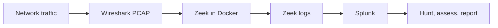

# Zeek-to-Splunk Network Threat Hunting Lab

> A hands-on SOC case study that transforms packet-capture data into searchable Zeek telemetry, triages network behavior in Splunk, and documents what the evidence does—and does not—support.

## Executive snapshot

| Area | Detail |
|---|---|
| Investigation question | Which hosts and connection states deserve analyst attention after a packet capture is converted into network telemetry? |
| Analyst role | Build the telemetry pipeline, normalize fields, test hunting hypotheses, and communicate a defensible disposition |
| Stack | Wireshark/Npcap, Kali Linux, Docker, Zeek, Splunk, SPL |
| Evidence | Zeek `conn.log` and `dns.log` observations, Splunk searches, screenshots, and troubleshooting notes |
| Outcome | Produced repeatable searches for source activity and incomplete connections; classified local mDNS behavior as expected and retained unusual states as leads requiring more context |
| Confidence | No compromise is claimed from this small lab dataset |

## Why this project matters

This lab demonstrates four habits that transfer to threat intelligence, exposure management, and SOC work:

- **Start with a question.** Searches are tied to an investigation hypothesis, not just a dashboard.
- **Separate signal from verdict.** High event counts and states such as `S0`, `OTH`, or `SHR` are triage leads—not proof of malicious activity.
- **Add context before escalating.** DNS, asset role, destination, baseline, and threat-intelligence enrichment determine priority.
- **Communicate uncertainty.** The final report records evidence, confidence, limitations, and the next collection step.

## Architecture

The raw PCAP and generated Zeek logs are not published. The repository contains the reproducible commands, searches, observations, and screenshots needed to review the workflow without exposing raw network traffic.

## Analyst workflow

1. Captured network traffic on Windows with Wireshark/Npcap.
2. Moved the PCAPNG into an isolated Kali Linux lab.
3. Processed the capture with Dockerized Zeek after a native-package dependency conflict.
4. Generated `conn.log`, `dns.log`, `ssl.log`, `weird.log`, and `x509.log`.
5. Ingested `conn.log` into Splunk with the `zeek_conn` sourcetype.
6. Parsed Zeek fields from raw tab-separated events with SPL.
7. Compared source activity and reviewed incomplete or unusual connection states.
8. Documented a disposition and the enrichment needed before escalation.

## Evidence and assessment

| Observation | Assessment | Analyst action |
|---|---|---|
| TCP/443 and UDP/53 activity | Common web and DNS behavior | Baseline by host and destination before alerting |
| UDP/5353, `.local`, `224.0.0.251`, and `ff02::fb` | Consistent with local multicast DNS discovery | Treat as expected unless frequency or asset context changes |
| `S0`, `OTH`, and `SHR` connection states | Can reflect failed, partial, or unusual connections | Group by source, destination, port, and time window; then correlate with asset and intelligence context |
| A host with a higher event count | Useful prioritization signal only | Compare against its normal role and unique destinations; do not equate volume with compromise |

**Disposition:** The available evidence supports a functioning collection-and-hunting pipeline. It does not support declaring an intrusion. The correct next step is enrichment, not attribution.

Read the concise [investigation report](docs/investigation_report.md) for the hypothesis, evidence, disposition, and next actions.

## SPL query library

- [Search all Zeek connection events](splunk_queries/search_all_zeek_conn.spl)
- [Extract a source IPv4 address](splunk_queries/extract_source_ip.spl)
- [Rank source hosts with destination context](splunk_queries/top_source_ips.spl)
- [Triage incomplete connection states](splunk_queries/suspicious_connection_states.spl)
- [Hunt for potential horizontal scanning](splunk_queries/potential_horizontal_scan.spl)

The scan threshold is an illustrative starting point for this lab. A production rule should be baselined by segment, asset role, approved scanner inventory, and time of day.

## Threat-informed enrichment

The next iteration correlates network destinations and DNS queries with vetted intelligence while preserving source, confidence, and indicator age. It then combines that result with asset criticality and control coverage so the analyst can prioritize an exposure instead of merely reporting an IOC.

See the [threat-enrichment plan](docs/threat_enrichment_plan.md).

## ATT&CK-informed hypothesis

Repeated connection attempts across many destinations may justify testing a **Network Service Discovery (T1046)** hypothesis. This mapping is a hypothesis to validate—not a finding. Confirmation would require a meaningful destination count, a tight time window, relevant ports, asset context, and exclusion of approved scanners or administrative tools.

## Reproduce the lab

1. Place your own PCAP/PCAPNG in a lab-only working directory.
2. Follow the [Dockerized Zeek commands](zeek_commands/docker_zeek_commands.md).
3. Upload `conn.log` to Splunk and assign the `zeek_conn` sourcetype.
4. Run the searches in [splunk_queries](splunk_queries/).
5. Record observations using the structure in [docs/investigation_report.md](docs/investigation_report.md).
6. Tune thresholds against your environment before creating an alert.

## Repository map

| Path | Purpose |
|---|---|
| `docs/` | Executive summary, investigation report, and enrichment design |
| `splunk_queries/` | Reusable SPL for parsing, triage, and hypothesis testing |
| `sample_outputs/` | Evidence-based observations from the lab |
| `screenshots/` | Visual record of setup, ingestion, extraction, and analysis |
| `notes/` | Workflow and troubleshooting decisions |
| `zeek_commands/` | Reproducible Docker/Zeek processing steps |

## Limitations

- This is a small lab capture, not production telemetry.
- Only a subset of generated Zeek logs was analyzed in Splunk.
- No endpoint, identity, vulnerability, or CMDB context was available.
- No external IOC match is asserted.
- Thresholds are starting points and require environmental baselining.

These limitations are intentional: they show where confidence ends and which data source should be added next.
