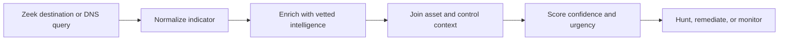

# Threat-Enrichment Plan

## Objective

Turn a network indicator into a prioritized, explainable action by combining telemetry, intelligence quality, asset exposure, and control context.

## Minimum intelligence record

| Field | Why it matters |
|---|---|
| Indicator value and type | Supports consistent matching across IP, domain, URL, or hash |
| Source and first/last seen | Preserves provenance and prevents stale indicators from driving decisions |
| Confidence | Separates confirmed infrastructure from low-confidence reporting |
| Threat/campaign and TTP | Moves the analysis beyond a raw IOC |
| Expiration or review date | Reduces false positives from recycled infrastructure |

## Prioritization logic

An intelligence match should become more urgent when it is:

- observed recently in local telemetry;
- supported by multiple trustworthy sources;
- associated with a relevant actor, campaign, or ATT&CK technique;
- connected to a critical or externally exposed asset;
- present where preventive or detective control coverage is weak; and
- corroborated by endpoint, identity, email, or vulnerability evidence.

A match should be downgraded when the indicator is stale, low confidence, shared infrastructure, an approved service, or unsupported by local evidence.

## Analyst decision record

For each match, record:

1. **What happened:** local event and time window.
2. **Why it matters:** intelligence source, age, confidence, and behavioral context.
3. **What is exposed:** asset role, criticality, vulnerability, and control coverage.
4. **Decision:** hunt, contain, remediate, block, monitor, or close.
5. **Evidence needed next:** the data source that could raise or lower confidence.

## Measures

- Percentage of matches with source, confidence, and expiration metadata
- Median time from match to analyst disposition
- False-positive rate by intelligence source
- Percentage of high-priority matches with asset ownership and criticality
- Remediation SLA attainment for confirmed exposures

This design keeps threat intelligence connected to operational decisions rather than treating an IOC count as an outcome.
